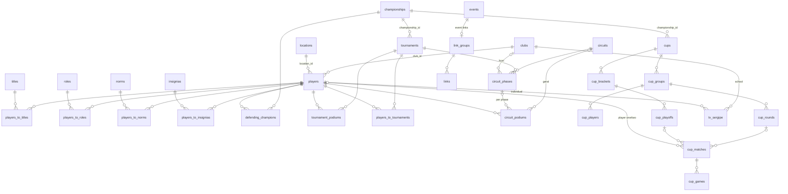

The schema lives in `packages/db/src/schema`, one file per table. Column names
are `snake_case` in SQL and `camelCase` in Drizzle. Every table has an integer
`id`, plus `created_at` and `updated_at` text timestamps in UTC.

## Entities

### People and affiliation

- **Player** (`players`): a registered chess player. Holds the three FSX
  ratings (`blitz`, `rapid`, `classic`, default 1900, range 0–4000), `active`
  (only active players appear in rankings), `verified`, optional `nickname`
  (unique), `cbx_id` and `fide_id` (unique), `birth_date` (`YYYY-MM-DD`), `sex`
  (`male` or `female`), photo, club, and location. `normalized_name` is the
  name lowercased without accents, used for search; the API keeps it in sync.
- **Club** (`clubs`): a chess club or school, with an optional logo URL. Schools
  in the School Games are clubs.
- **Location** (`locations`): a `city`, `state`, or `country`, with an optional
  flag URL.

### Recognition

- **Title** (`titles`): an `internal` title (awarded by the FSX, such as GMS) or
  an `external` one (CBX/FIDE, such as CM). Linked to players through
  `players_to_titles`. See [Titles](/guide/titles).
- **Role** (`roles`): a `management` (board), `referee` (arbiter), or `teacher`
  position, with a unique short name. Linked through `players_to_roles`; the
  members page reads these.
- **Norm** (`norms`): a result counting toward a state title. Linked through
  `players_to_norms`.
- **Insignia** (`insignias`): a badge with a numeric `level`. Linked through
  `players_to_insignias`.

### Competitions

- **Championship** (`championships`): a recurring competition, such as the
  Sergipe Open. Groups tournaments and cups across years.
- **Tournament** (`tournaments`): one event with a `rating_type`, an optional
  `date` and Chess-Results URL, and an optional championship.
- **Tournament podium** (`tournament_podiums`): a player's final `place` in a
  tournament. The champions gallery and player achievements come from podiums
  of tournaments that belong to a championship.
- **Defending champion** (`defending_champions`): the current holder of a
  championship.
- **Rating history** (`players_to_tournaments`): the rating a player had before
  a tournament and the variation it produced. See
  [rating history](#ratings-and-rating-history).
- **Circuit** (`circuits`): a season ranking across several tournaments. Its
  `type` (`default`, `categories`, `school`, or `geral`) selects the
  [layout](/guide/circuits#circuit-types).
  - **Circuit phase** (`circuit_phases`): one stage, played at a tournament,
    optionally hosted by a club, ordered by `sort_order`.
  - **Circuit podium** (`circuit_podiums`): points for a player, attached to
    **either** a phase **or** directly to the circuit (`geral` circuits), with
    an optional place (1–25) and category.
- **Cup** (`cups`): a bracket-and-group competition with a prize pool and rating
  type. See [Cups](/guide/cups).
  - **Group** → **cup players** and **rounds** → **matches** → **games**.
  - **Bracket** (`UB` upper, `LB` lower, `GF` grand final) → **playoffs**
    (named phases) → **matches** → **games**.
  - A match belongs to a round or to a playoff, has two players, a `best_of`,
    and an optional winner.
- **School Games result** (`tv_sergipe`): one placement in the TV Sergipe School
  Games. See [school scoring](#school-games-scoring).

### Publishing

- **Post** (`posts`): a news article with a unique `slug`, Markdown content, an
  optional image, and `published`. Only published posts are public.
- **Announcement** (`announcements`): an official notice numbered per year;
  `(year, number)` is unique.
- **Event** (`events`): an upcoming event with a `start_date`. Its links
  (regulations, registration form, results) live in one link group owned by the
  event.
- **Link group** and **link** (`link_groups`, `links`): labeled groups of links,
  all listed on `/links`; an event's group is labeled with the event name. A link has a `type` (`link`,
  `regulation`, `form`, or `results`), an icon from a fixed allowlist, and a
  `sort_order`.

### System tables

`user`, `session`, `account`, and `verification` belong to Better Auth.
`rate_limits` stores D1-backed rate-limit windows. `d1_migrations` is the
migration tracker. None of them is exposed by public procedures.

## Relationships

## Deletion behavior

D1 enforces foreign keys. A delete that a reference blocks fails with a
foreign-key error, which the API returns as `CONFLICT`.

| Deleting a… | Also deletes | Blocked while referenced by |
| ----------- | ------------ | --------------------------- |
| player (no API procedure) | title, role, norm, and insignia links | rating history, tournament and circuit podiums, defending champions, cup players and matches |
| club | — | players, circuit phases, School Games results |
| location | — | players |
| title, role, norm, insignia | its player links | — |
| championship | its defending champions | tournaments, cups |
| tournament | its podiums | rating history (revert it first), circuit phases |
| circuit | its phases and their podiums, and its own podiums | — |
| circuit phase | its podiums | — |
| cup | groups, players, rounds, brackets, playoffs, matches, games | — |
| event | its link group and links | — |
| link group | its links | — |
| post, announcement | — | — |

Rating history and School Games results are never deleted as a side effect:
a tournament with rating results must have them reverted first (see
[corrections](#corrections)), and a school with results must have them deleted
first. A tournament with results also cannot change its rating type.

A deleted player in a School Games individual result would set `player_id` to
null, which the participant check then rejects, so in practice the player
cannot be removed while such a result exists.

## Ratings and rating history

A player has three current ratings, one per `rating_type`: `blitz`, `rapid`,
and `classic`. A tournament has exactly one rating type.

The rating update (`playersTournament.linkWithRating`, used by the dashboard's
**Rating update** import) records one tournament result:

1. The tournament must exist and have the same rating type as the update.
2. The new rating is `old + variation` and must stay within 0–4000.
3. The player's rating is updated **only if it still equals the value read**
   (compare-and-swap). Otherwise the call returns `CONFLICT`: another edit
   happened in between, so reload and retry.
4. The history row is inserted in the same D1 batch, guarded by `changes() = 1`,
   so it exists only when the rating update applied
   ([ADR 0004](/decisions/0004-d1-rating-batch)).

### The history chain

A player's history rows of one rating type form a chain in **insertion (`id`)
order**, which is the order the results were applied (not the tournament date):

- each row's `old_rating` equals the previous row's `old_rating + variation`
  (the first row starts from the player's rating before any import);
- the last row's `old_rating + variation` equals the player's current rating.

**Import tournaments in date order.** Each variation is calculated from the
player's rating at that moment, so the chain follows import order on purpose.
A tournament imported late (after a newer one) is still consistent: it was
applied to the rating the player had when it was imported, and it appears after
the newer tournament in the history. Putting it back in date order would change
the starting rating of every tournament after it, and their variations would
then need recalculating outside the site.

Invariants:

- At most one history row per `(player, tournament)`; recording the same
  tournament twice returns `CONFLICT`.
- `old_rating` is within 0–4000 and `variation` within −4000 to 4000.
- A history row's `rating_type` equals its tournament's.
- The chain holds. `players.update` can still set a rating by hand without
  writing history; the dashboard only sends a rating it was asked to change, and
  `packages/db/src/audits/rating-history-sync.sql` lists every break.

### Corrections

Never fix a result by deleting the tournament or editing the rating by hand.
Each correction runs as one D1 batch, computes its delta from the stored row
inside the batch, and keeps the chain intact:

| Procedure | Dashboard | Effect |
| --------- | --------- | ------ |
| `playersTournament.correctVariation` | Player → Rating history → Save | Sets the new variation; shifts the current rating and every later row's `old_rating` by the difference. |
| `playersTournament.remove` | Player → Rating history → Remove | Deletes the row; subtracts its variation from the current rating and every later row's `old_rating`. |
| `playersTournament.revertTournament` | Tournament → Rating results → Revert all | Does `remove` for every participant; the corrected file can then be imported again. |

Later variations are kept as recorded: the federation computes them outside the
site, and a small change in the starting rating does not change them.
A correction that would push the current rating or any later `old_rating` out
of 0–4000 is rejected and changes nothing.

The [K-factor rules](/guide/rating-variation) decide the variation; the site
stores the result and does not compute it.

## School Games scoring

A `tv_sergipe` row is one placement:

- `club_id` is the school; `age_group` is `8`, `10`, `12`, `14`, `16`, or `18`;
  `sex` is `male` or `female`; `modality` is `individual` or `team`.
- Individual rows name a `player_id` and no team; team rows name a `team_name`
  (`A`–`J`, to tell apart several teams from one school) and no player.
- `place` is 1–8, and `points` follow it: 10, 8, 6, 5, 4, 3, 2, 1.
- A player has at most one individual result per age group and sex; a school's
  team letter is unique per age group and sex.

`tvSergipe.leaderboard` groups rows by school, filtered by age group, sex, and
modality:

- **Points** are summed once per placement, for individuals and teams alike.
- **Medals** count places 1, 2, and 3 as gold, silver, and bronze. A team
  placement counts as **two** medals (`TEAM_MEDAL_WEIGHT`) and an individual
  one as **one** (`INDIVIDUAL_MEDAL_WEIGHT`).

## Public and administrative data

| Data | Public | Admin only |
| ---- | ------ | ---------- |
| Players | name, nickname, ratings, photo, club, location, titles, roles, podiums, rating history, FSX/CBX/FIDE IDs, `active`, `verified` | `birth_date`, `sex` (used for filters but never returned), `description`, inactive players in rankings |
| Posts | published posts | drafts |
| Everything else | yes | — |
| Auth, rate limits, counts, cache status | — | yes |

Age-group and sex filters on `/ratings` run in SQL, so birth dates never leave
the server. The Swiss Manager export is the only bulk output with birth dates,
and it is admin only. See [Governance and privacy](/operations/governance-and-privacy).
